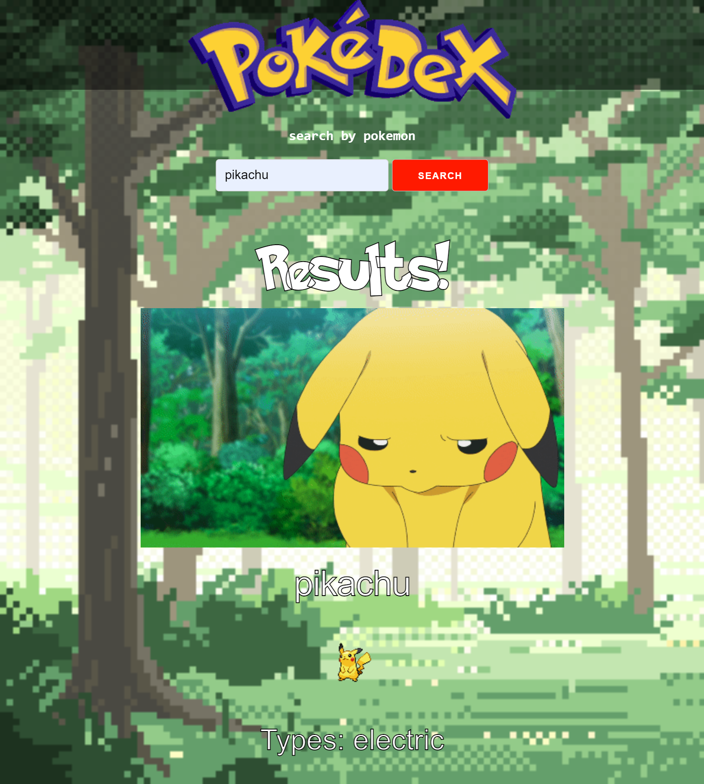

# PokeDex: 07 Project 1 - Interactive Front-End Application

## Description
This PokeDex pulls information from the PokeApi and the images from the GiphyApi to render cards on the screen displaying information about the user-searched Pokemon. 


## User Story

```
AS A Poketrainer
I WANT to view a potential Pokemon in my area
SO THAT I can review their information and characteristics to better prepare for encounters with them along my way.
```

## Acceptance Criteria

```
GIVEN I need to view details about different Pokemon
WHEN I load the PokeDex
THEN I am presented with a search screen to locate Pokemon dependent on name or number
WHEN I search the Pokemon
THEN the results screen is populated
WHEN I review the results page
THEN I am presented with the Pokemon's name, a recent photo or avatar, and information about them
WHEN I resize the page or view the site on various screens and devices
THEN I am presented with a responsive layout that adapts to my viewport
```

## Preview


## Deployed Application
https://cviguers.github.io/project-one/
